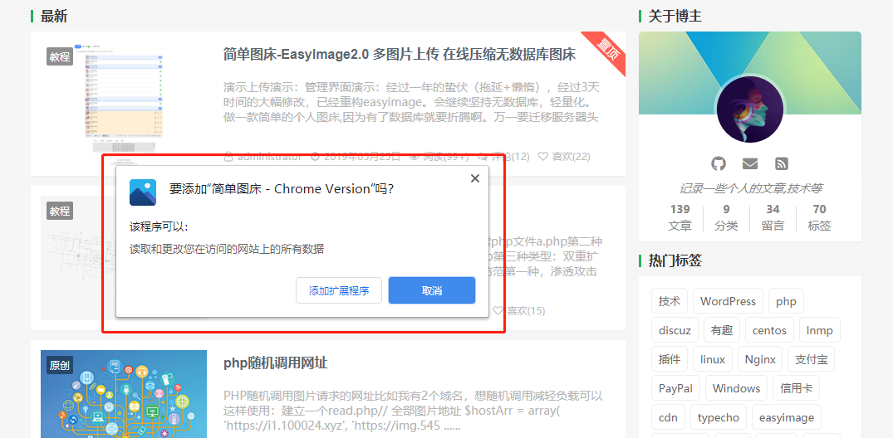
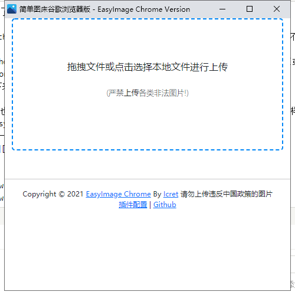
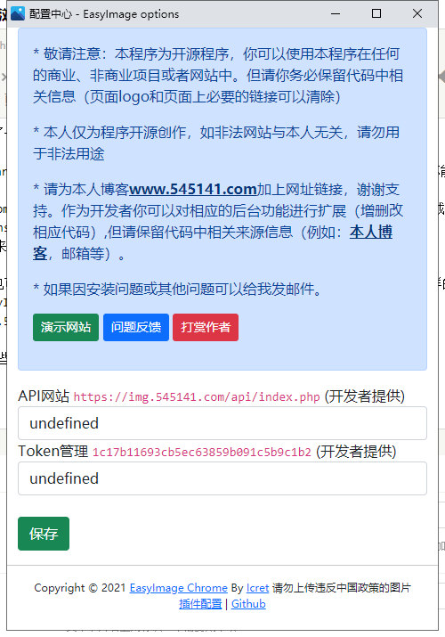

1. 使用Edge浏览器的[扩展中心](https://microsoftedge.microsoft.com)，搜索 `简单图床` 安装后初始化配置即可使用 直达->[简单图床 Edge版](https://microsoftedge.microsoft.com/addons/detail/hdafcoenpmebcjjcccojdlhfnndelefk)
2. 直接下载[Edge.crx](https://raw.githubusercontent.com/icret/EasyImage-Browser-Extension/main/Edge.crx) ，然后拖入Edge浏览器内 | [开源地址](https://github.com/icret/EasyImage-Browser-Extension)
3. 登录图床后台->图床安全->高级设置->开启API上传

### 界面演示：

