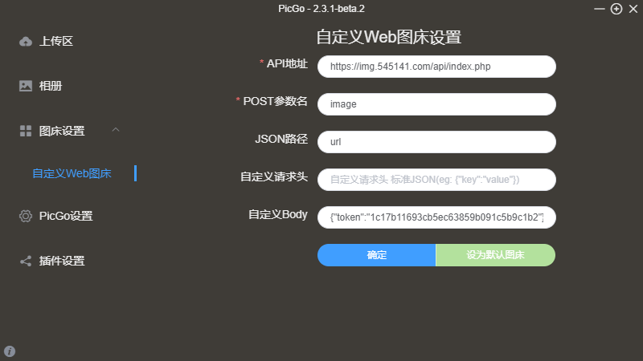

1. 下载最新版[PicGo-windows版][1]或者[PicGo-mac版][2]（测试版本：PicGo-Setup-2.3.1-x64/PicGo-Setup-2.4.0-beta.0-x64）
2. 安装后在插件设置中搜索`web-uploader 1.1.1` 并安装（下载插件可能需要[node.js][3]插件）
3. 图床设置-自定义Web图床中按照如下方式填写，然后点击确定并设置为默认图床。
4. 登录图床后台->图床安全->高级设置->开启API上传




```PicGo
API地址:https://png.cm/api/index.php // 输入你网站api地址
POST参数名: image
JSON路径: url
自定义Body: {"token":"1c17b11693cb5ec63859b091c5b9c1b2"} // 这里输入你网站生成的token
```

  [1]: https://github.com/Molunerfinn/PicGo/releases
  [2]: https://github.com/Molunerfinn/PicGo/releases
  [3]: https://nodejs.org/zh-cn/
