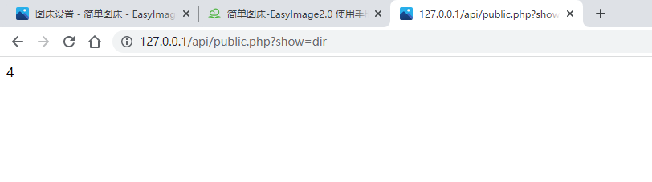

可用让网站提供一些可用对外展示的数据
- 首先在`图片安全`开启开放数据
- 根据需要选择要对外展示的数据

现在就可以直接访问指定参数的链接获得数据了。
例如获得已经建立的文件夹：http://127.0.0.1/api/public.php?show=dir


jQuery调用演示代码

```html
<span id="public"></span>
<script src="https://cdn.jsdelivr.net/npm/jquery@3.2.1/dist/jquery.min.js"></script>
<script>
 $.ajax({ //创建ajax对象
 url:  "http://127.0.0.1/api/public.php",
 data: { //发送到服务器的数据
 show:  "file",
        },
 success:  function(resp) { //服务器响应成功的数据
 //resp服务端响应过来的数据
 $("#public").text(resp); //渲染到浏览器上
        }
    });
</script>
```

或者

```html
<p>今日上传<span id="public_today">loading...</span>张图片</p> 
<p>本站已托管<span id="public_file">loading...</span>张图片</p>

<script src="https://cdn.jsdelivr.net/npm/jquery@3.2.1/dist/jquery.min.js"></script>

<script>
$("#public_today").load("http://127.0.0.1/api/public.php?show=today");$("#public_file").load("http://127.0.0.1/api/public.php?show=file");
</script>
```
