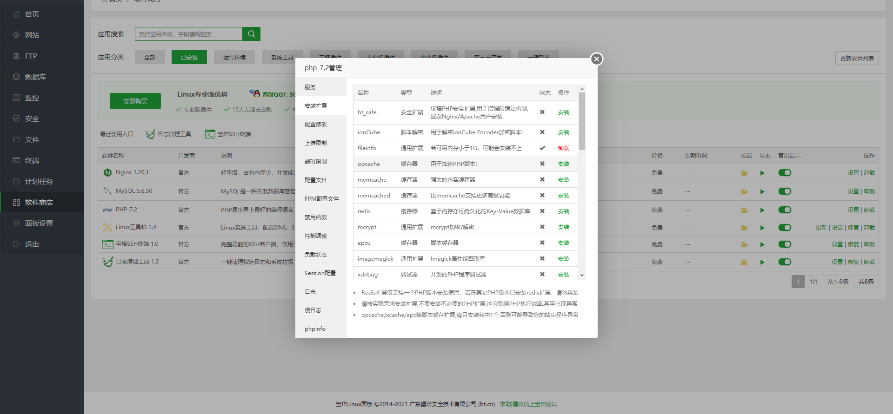

- 安装PHP扩展

- Lnmp

[lnmp安装扩展教程](https://www.vpser.net/manage/lnmp-php-install-ext.html)

- 宝塔面板：

打开宝塔后台->软件商店->已安装->选择php->设置->安装`Fileinfo` `iconv` `zip` `mbstring` `openssl`扩展（如果没有就是已经安装了）

- 有条件的建议开启OPcache

